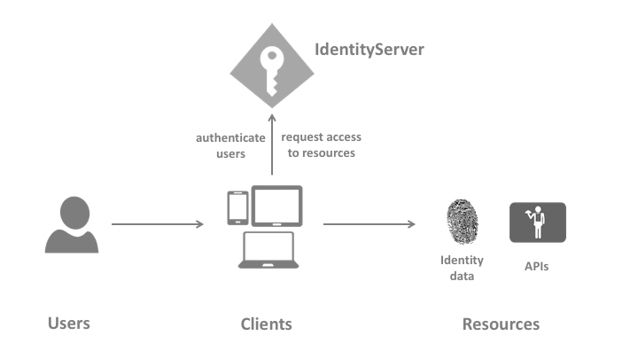
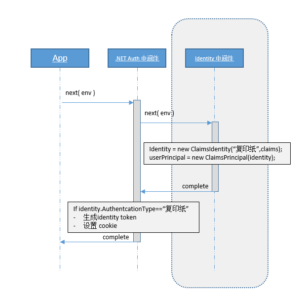
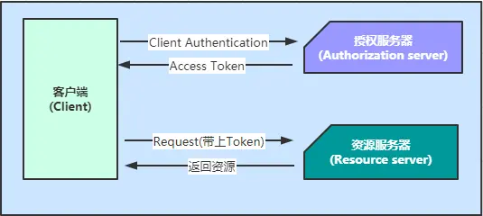
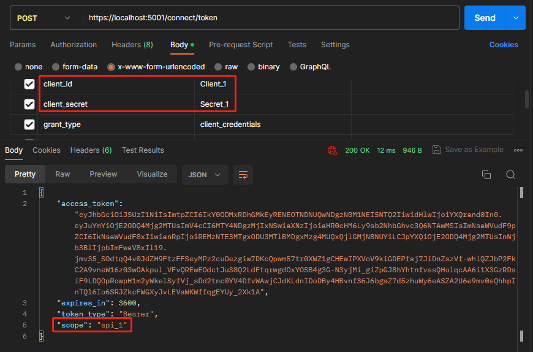
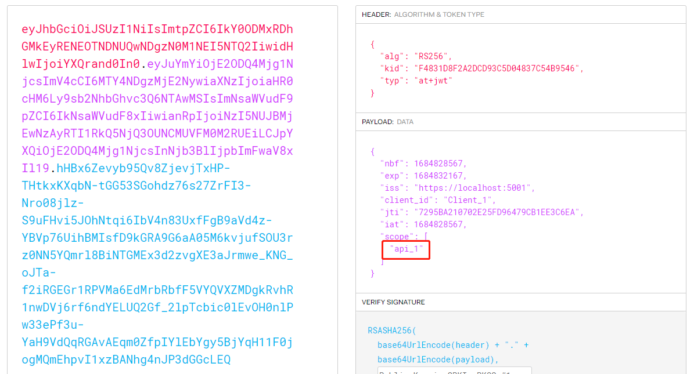
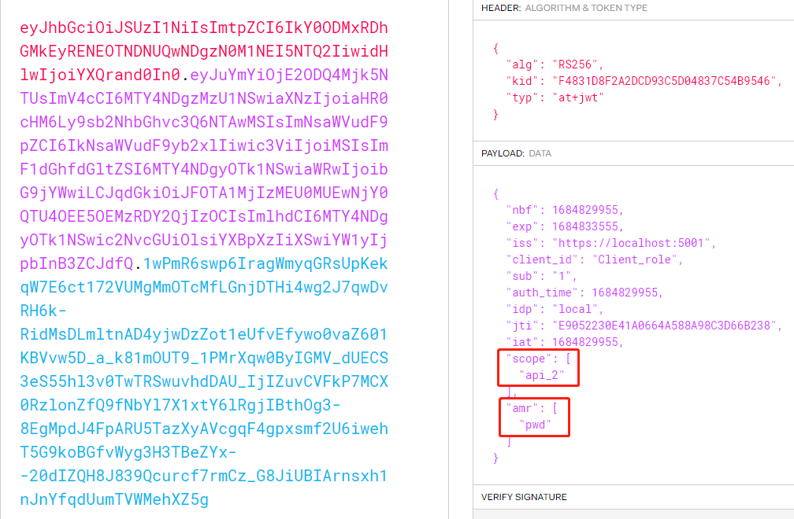
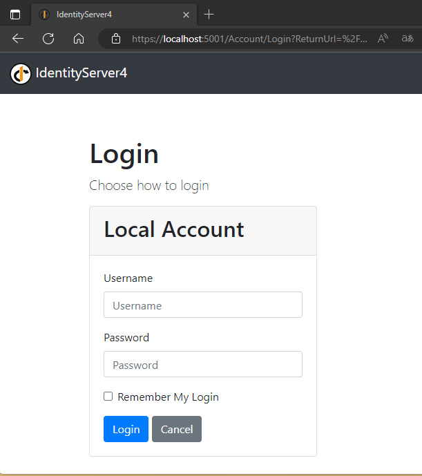

# PuHua_DataMining
## **普华数据挖掘**

 

## **IdentityServer4（IDS4）**
* 是为ASP.NET Core 系列打造的基于OpenID Connect 和 OAuth 2.0的认证授权框架。
* OAuth2.0是一个开放授权标准，允许用户授权第三方应用访问该用户在某服务上的私有资源。
* OIDC = （Identity Authentication + OAuth2.0。是一个基于OAuth2.0协议的身份认证标准协议。

 

## **优点**
* **安全性高**：包括基于角色的访问控制、OAuth2和OIDC等标准认证协议，保护应用程序。
* **灵活性强**： 使用大量插件，支持多种客户端类型，满足不同场景需求。
* **易于集成**：提供丰富的SDK和实例代码，便于快速集成。
* **监控数据流转**：在认证、授权、服务请求等关键操作上触发时间，通过订阅时间来监控数据流转。

 

## **术语**

**1. Users**： 用户

**2. Clients**： 客户端

**3. Resources**: Identity data、 APIs

**4. Identity Server** : 认证服务器

**5. Token**:  Identity Token(身份令牌)、 Access Token(访问令牌)

 

___

## **Claim**
> 用于表示用户或客户端相关信息的数据结构

通常包含用户的身份信息、权限、属性等内容，用于在不同的安全上下文中传递和验证用户身份信息,并且可以在授权过程中通过token传递给应用程序。

 

## **JWT Token**
> 用来在身份提供者和服务提供者间传递被认证的用户身份信息。

便于从资源服务器获取资源，也可以增加一些额外的其他业务逻辑所必须的声明信息。通过JWT配置、签名和加密等操作来保证令牌的真实性和安全性。

 

## **授权模式**
## **客户端模式(Client Credentials)**
### **认证流程**

1. 客户端访问授权服务器，服务器校验后返回Access Token.
2. 客户端使用Access Token访问资源服务器。

 

## **postman测试结果**
**携带客户端id和secret访问授权服务器**

 

**获得的Access token**

 

## **密码模式（ Resource Owner Password Credentials）**
**携带账号和密码访问授权服务器**

 

**获得的Access token**

 

## **OIDC**

 

 

## **代码目录**
IdentityServer4-master

    ├─Client
    ├─IdentityServer
    ├─MvcClient
    └─WebApi
